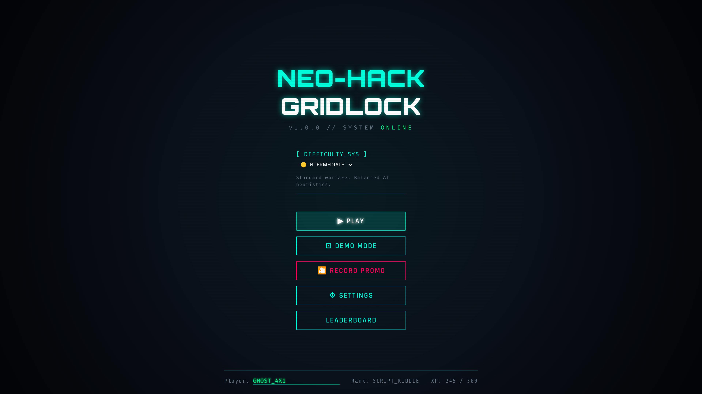
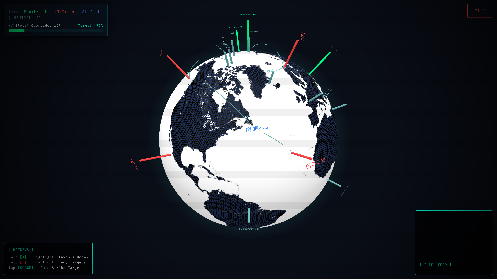
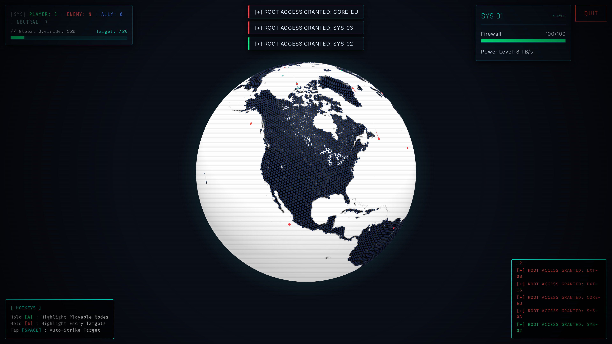
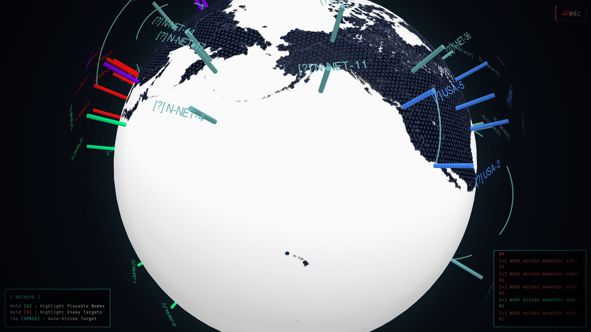
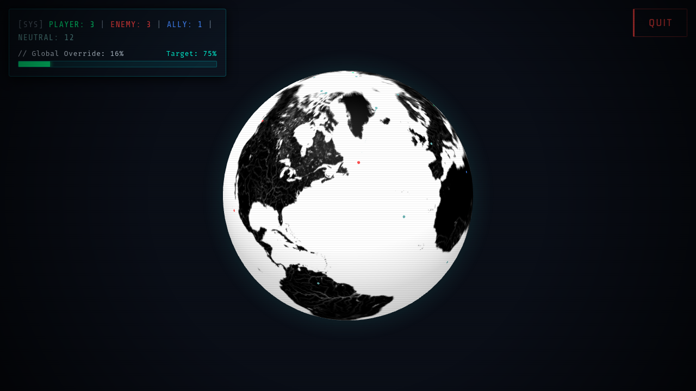
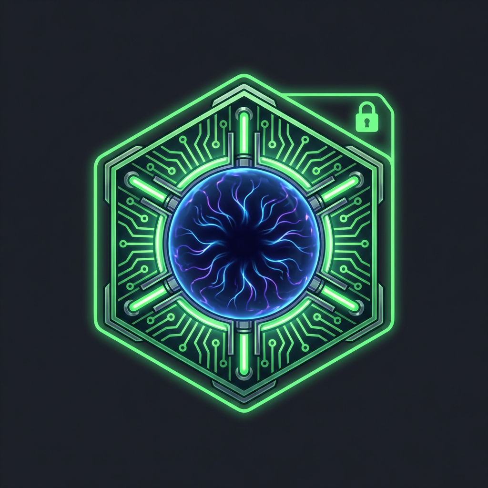
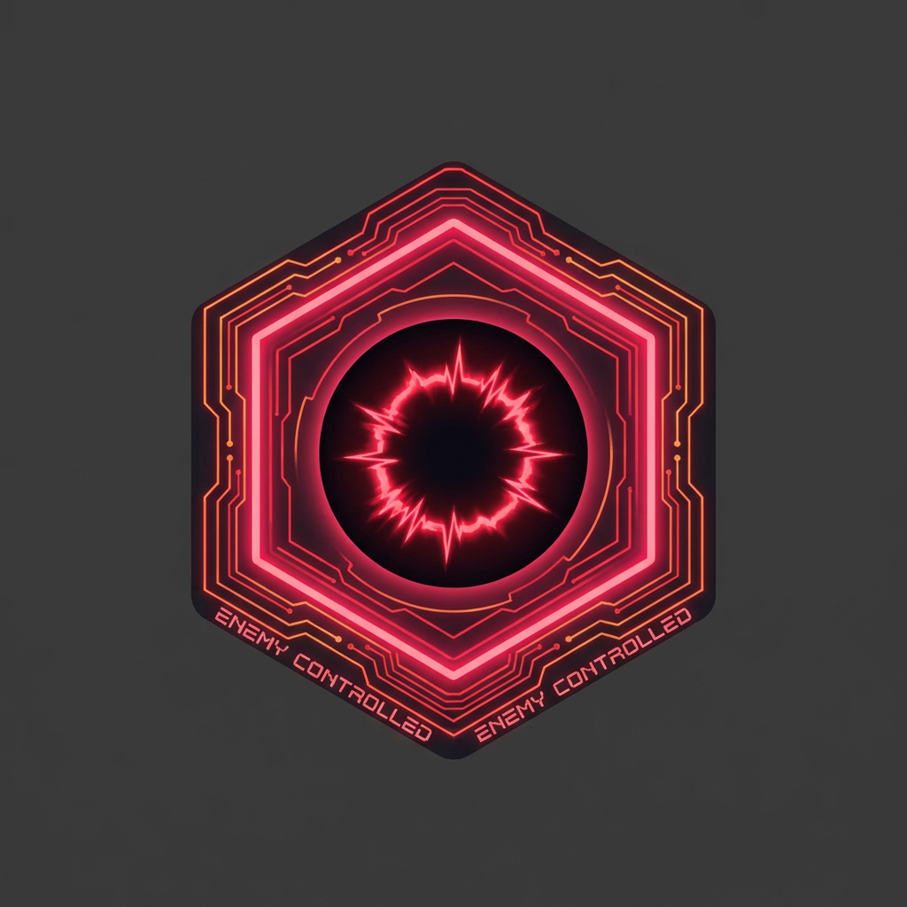
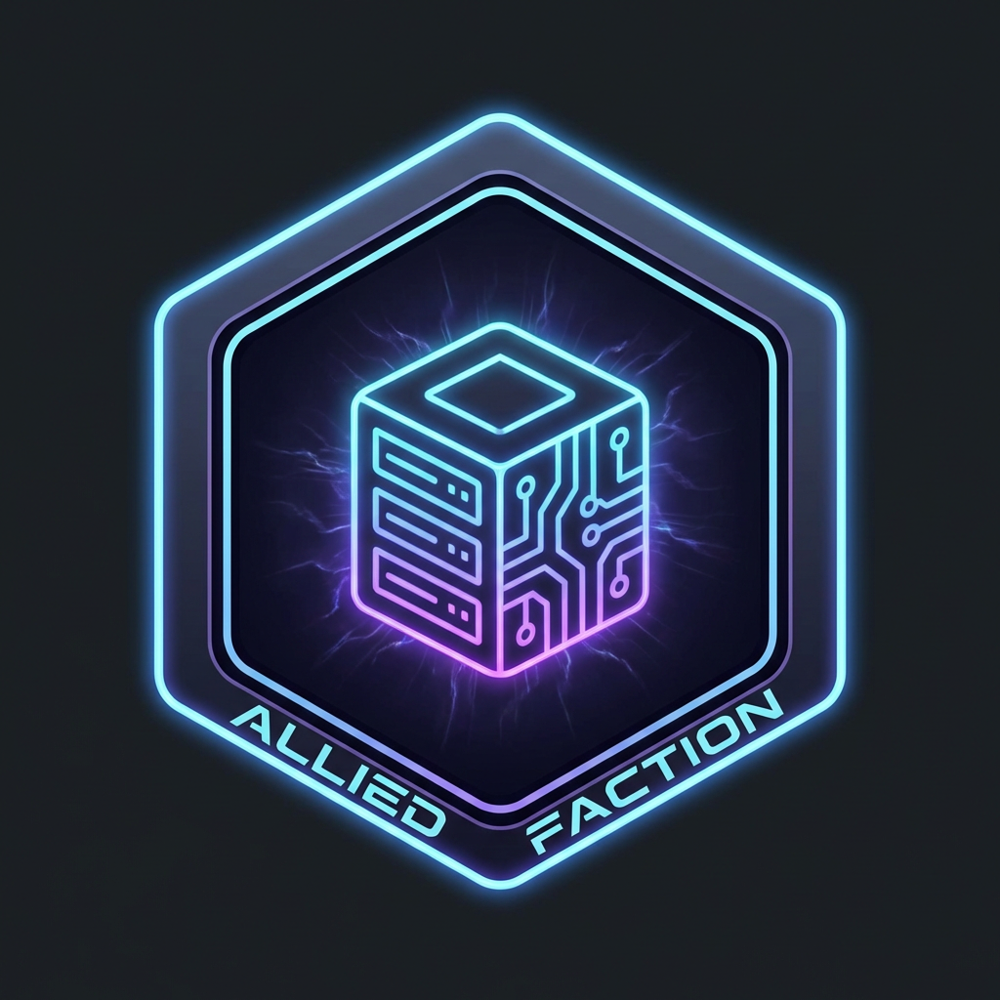
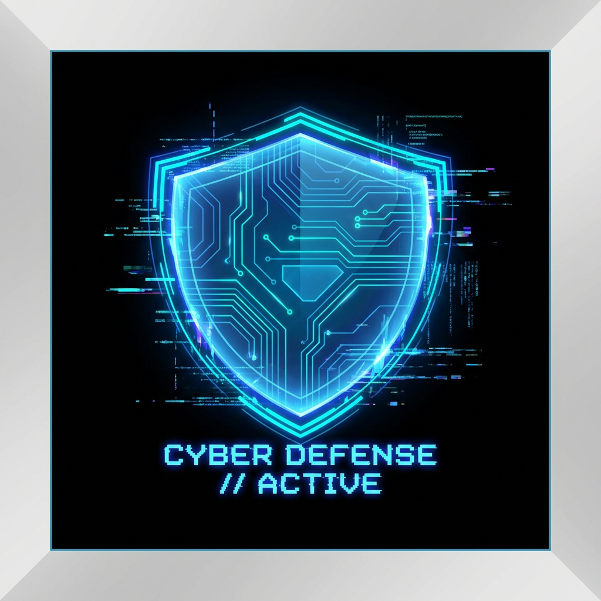
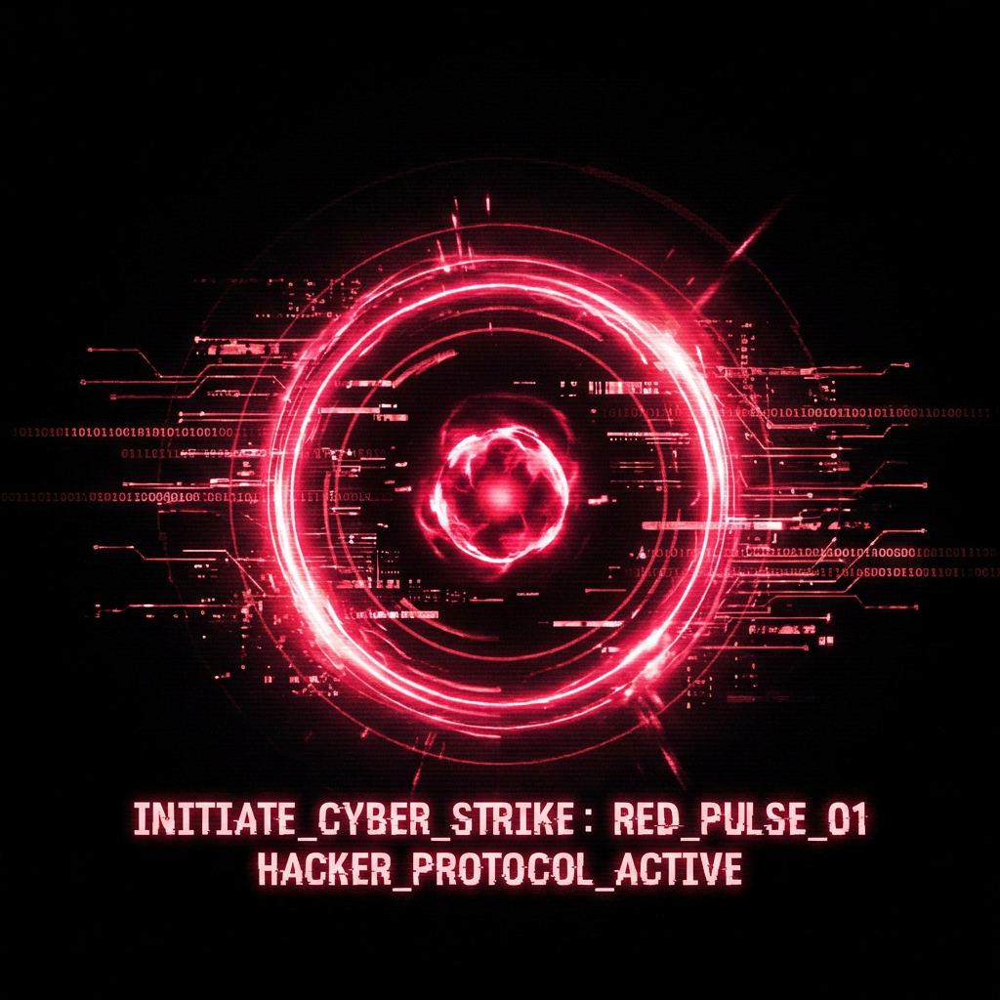

# 🌐 Neo-Hack: Gridlock v3.2

[](https://xaviercallens.github.io/webwarcybergame/)
[](#-test-coverage)
[](#-whats-new-in-v320)
[](#-license)

> **Asymmetric Cyber Warfare Strategy — Turn-Based, Multi-Modal, Accessible.**

**Neo-Hack: Gridlock** is an immersive, browser-based cyber warfare strategy game played on a 3D globe. Choose your role — **Attacker** or **Defender** — and battle through asymmetric, turn-based scenarios where stealth, timing, and resource management decide the outcome. AI opponents are powered by rule-based and RL-trained agents via a Gymnasium environment.

---

## 🎬 Trailer

<video src="https://github.com/xaviercallens/webwarcybergame/raw/main/docs/neo_hack_promo_trailer.mp4" width="100%" controls autoplay loop muted playsinline></video>

> **[▶ Download the trailer (MP4)](docs/neo_hack_promo_trailer.mp4)**

---

## 🎮 v3.2 Demo — Operation Crimson Tide (10 min)

<video src="https://github.com/xaviercallens/webwarcybergame/raw/main/specs/demo_recordings/demo_crimson_tide_10min.mp4" width="100%" controls muted playsinline></video>

> **[▶ Download full demo (MP4, 9 MB)](specs/demo_recordings/demo_crimson_tide_10min.mp4)** | **[📄 Playthrough log](specs/demo_recordings/demo_playthrough_log_2026-03-21T09-07-58.txt)** | **[📄 API call log](specs/demo_logs/demo_api_log_20260321_093347.txt)**

This **8-minute recorded gameplay session** showcases the full v3.2 experience:

| Timestamp | Phase | What You'll See |
|-----------|-------|-----------------|
| 0:00 – 0:30 | **Login & Setup** | User authentication, menu navigation, difficulty & scenario selection |
| 0:30 – 1:00 | **Role Select** | Attacker faction card (Scarlet Protocol), mission briefing overlay |
| 1:00 – 2:30 | **Turns 1–3: Recon** | Node selection on 2D tactical map, SCAN & BREACH actions via action panel |
| 2:30 – 4:00 | **Diplomacy** | Silk Road Coalition chat, trade proposal, Sentinel Vanguard negotiation |
| 4:00 – 6:30 | **Turns 4–7: Assault** | Deep network penetration, alternating SCAN/BREACH on Iron Grid nodes |
| 6:30 – 7:00 | **Sentinel Lab** | AI agent creation with tunable parameters |
| 7:00 – 8:30 | **Turns 8–10: Exfiltration** | Final data extraction push, mission conclusion |

**87 demo actions** and **84 API calls** were captured during recording — full logs available in [`specs/demo_logs/`](specs/demo_logs/).

---

## 📸 Screenshots

<div align="center">
  
  
  
</div>
<div align="center">
  
  
</div>

---

## 🌟 What's New in v3.2.0

### Headline Features

- **Turn-Based Gameplay** — Replace real-time loops with strategic turn-based combat (20–100 turns, alternating attacker/defender)
- **Asymmetric Factions** — Attacker (3 AP, exploit kits, stealth) vs Defender (2→3 AP, IR budget, alert scaling)
- **Operation Crimson Tide** — Flagship scenario: 16-node Eastern European banking network, 5 factions, asymmetric win conditions ([full scenario spec](specs/SCENARIO_OPERATION_CRIMSON_TIDE.md))
- **Fog of War** — Attacker discovers nodes progressively; Defender sees all but blind to undetected compromises
- **15 Game Actions** — 8 attacker + 7 defender actions, all executable via GUI, CLI, hotkeys, or gamepad
- **Full CLI Console** — Tab-complete, command history, aliases — mirrors all GUI actions
- **RL Agent Backend** — Rule-based pretrained agents (novice/normal/expert) with Gymnasium environment + PPO training pipeline

### Additional v3.2 Additions

- **Role Select Screen** — Choose Attacker or Defender with faction stat cards before each mission
- **Interactive Tutorial** — 9-step guided tutorial with highlight boxes and event-gated progression
- **Mission Briefings & Debriefs** — Narrative overlays with objectives and XP breakdown
- **Gamepad Support** — Full Xbox/PlayStation controller mapping (D-pad, face buttons, triggers)
- **Accessibility** — ARIA live regions, focus traps, reduced motion, high contrast, UI scaling 0.8×–1.5×
- **8 New UI Components** — Briefing, Debrief, Toast, LogPanel, NodeTooltip, ContextMenu, PauseMenu, HelpOverlay
- **250 Tests** — 172 frontend unit + 29 E2E + 78 backend unit, all passing
- **Demo Recording System** — Automated Playwright-based video capture with API logging middleware

---

## ✨ Features

- **Interactive 3D Globe** — Built on `Three.js` and `Globe.gl` with click-to-select nodes, status overlays, and fog of war
- **Turn-Based Strategy** — Plan each action carefully — AP, stealth, and exploit kits are finite resources
- **RL-Powered AI** — Gymnasium environment (`NeoHackEnv`) with rule-based and trainable PPO agents
- **Multi-Modal Input** — Mouse/keyboard, CLI console, hotkeys (`1`-`7`), and gamepad — all produce identical results
- **Event-Driven Architecture** — Lightweight event bus decouples all UI components for clean state management
- **Cyberpunk Aesthetics** — CRT scanlines, glitch effects, neon palettes, procedural audio, and atmospheric sound design
- **Scenario Engine** — Structured scenario data with node maps, faction configs, objectives, and action modifiers
- **WebSocket Real-time Sync** — Live game state updates via persistent WebSocket connections

---

## 🚀 Quick Start

### Prerequisites
- **Node.js** v20+
- **Python** 3.11+

### One-Command Launch

```bash
git clone https://github.com/xaviercallens/webwarcybergame.git
cd webwarcybergame/CascadeProjects/windsurf-project
chmod +x launch_local.sh
./launch_local.sh
```

This script installs dependencies, starts the backend (port 8000), builds the frontend, runs health checks, and opens the browser.

### Manual Launch (Development)

```bash
# 1. Backend
cd backend
python -m venv .venv && source .venv/bin/activate
pip install -r requirements.txt
JWT_SECRET=dev-secret PYTHONPATH=src python main.py
# → http://localhost:8000  (health: /api/health)

# 2. Frontend (separate terminal)
cd build/web
npm install
npm run dev
# → http://localhost:5173
```

### Run Tests

```bash
# Frontend unit tests (Vitest — 172 tests)
cd build/web && npm test

# Frontend E2E tests (Playwright — 29 tests)
cd build/web && npm run test:e2e

# Backend unit tests (pytest — 78 tests)
cd backend && source .venv/bin/activate
PYTHONPATH=src JWT_SECRET=test pytest
```

---

## 🎮 Player Guide

### Game Flow

```
LOGIN → MENU → ROLE SELECT → BRIEFING → GAME → DEBRIEF
```

1. **Login or Register** — Create an account (username + password)
2. **Menu** — Select difficulty (Novice / Normal / Expert) and scenario
3. **Choose Role** — **Attacker** (Scarlet Protocol) or **Defender** (Iron Bastion)
4. **Read Briefing** — Mission narrative, objectives, faction stats, map preview
5. **Play Turns** — Select nodes on the map, execute actions via GUI / CLI / hotkeys / gamepad
6. **Debrief** — Post-game incident report with XP breakdown, win/loss stats

### Attacker Strategy

| Phase | Turns | Goal | Key Actions |
|-------|-------|------|-------------|
| **Recon** | 1–4 | Map the network | `SCAN_NETWORK`, `PHISHING` |
| **Intrusion** | 5–10 | Gain footholds | `EXPLOIT_VULNERABILITY`, `ELEVATE_PRIVILEGES` |
| **Expansion** | 11–16 | Reach target | `LATERAL_MOVEMENT`, `INSTALL_MALWARE` |
| **Extraction** | 17–20 | Exfiltrate data | `EXFILTRATE_DATA`, `CLEAR_LOGS` |

> **Win condition:** Exfiltrate data from the target node before time runs out.

### Defender Strategy

| Phase | Turns | Goal | Key Actions |
|-------|-------|------|-------------|
| **Monitoring** | 1–6 | Detect intrusion | `MONITOR_LOGS`, `SCAN_FOR_MALWARE` |
| **Hardening** | 7–12 | Patch & fortify | `APPLY_PATCH`, `FIREWALL_RULE` |
| **Response** | 13–20 | Contain & eject | `ISOLATE_HOST`, `INCIDENT_RESPONSE`, `RESTORE_BACKUP` |

> **Win condition:** Raise alert level to 100 (attacker caught) or survive until max turns.

### Controls Reference

| Input | Action |
|-------|--------|
| `Click` node | Select target |
| `Right-click` node | Context menu with role actions |
| `1`–`7` | Execute action by slot |
| `Space` | End turn |
| `` ` `` (backtick) | Toggle CLI console |
| `Tab` | Autocomplete CLI command |
| `↑` / `↓` | CLI command history |
| `Esc` | Pause menu |
| `F1` | Help overlay |
| `Ctrl+H` | Toggle high contrast |
| Gamepad `A` / `X` | Confirm / Action |
| Gamepad `D-pad` | Navigate nodes |
| Gamepad `Start` | Pause |

> Full reference with all keybindings, CLI commands, and gamepad mapping: **[docs/CONTROLS.md](docs/CONTROLS.md)**

### CLI Commands

**Attacker commands:**
```
scan [node]          — Scan network from a node
exploit [node]       — Exploit a vulnerability
phish [node]         — Phishing attack
malware [node]       — Install persistent malware
privesc [node]       — Elevate privileges
lateral [node]       — Move to adjacent node
exfil [node]         — Exfiltrate data
clearlogs [node]     — Clear attack evidence
```

**Defender commands:**
```
monitor [node]       — Check system logs
scanmal [node]       — Scan for malware
patch [node]         — Apply security patch
isolate [node]       — Quarantine a host
restore [node]       — Restore from backup
firewall [node]      — Add firewall rule
ir [node]            — Incident response
```

**Meta commands:** `help`, `status`, `endturn`, `quit`

---

## 🗺️ Scenarios

### Featured: Operation Crimson Tide

> *A state-sponsored APT group targets an Eastern European banking cluster. The clock is ticking.*

```
                    [Internet]
                        |
                   ┌────┴────┐
              (1) DMZ-FW    (2) VPN-GW
                   │              │
              ┌────┴────┐    ┌───┴───┐
         (3) WEB-01  (4) WEB-02  (5) MAIL-SRV
              │         │         │
              └────┬────┘    ┌───┘
              (6) APP-LB ────┤
              ┌────┴────┐    │
         (7) APP-01  (8) APP-02
              │         │
              └────┬────┘
              (9) INT-FW
              ┌────┴────┐
        (10) LDAP-DC  (11) FILE-SRV
              │              │
              └──────┬───────┘
              (12) CORE-DB  ←── TARGET
              │
        (13) BACKUP-SRV
              │
        (14) SIEM-MON ─── (15) LOG-AGG ─── (16) HONEYPOT
```

**5 asymmetric factions** compete for control:

| Faction | Role | Nodes | AP | Special |
|---------|------|-------|----|---------|
| **Scarlet Protocol** (Player) | Attacker | 2 entry points | 3/turn | 5 exploit kits, 100% stealth |
| **Iron Bastion** (AI) | Defender | 5 core nodes | 2→3/turn | 8 IR credits, scales at alert ≥50 |
| **Silk Road Coalition** | NPC Diplomacy | 4 trade nodes | — | Negotiable via Gemini LLM chat |
| **Shadow Cartels** | NPC Hostile | 2 dark nodes | — | Low defense, easy early targets |
| **Sentinel Vanguard** | NPC Potential Ally | 3 monitoring nodes | — | Alliance requires trust |

**Why no equilibrium:** The attacker has **tempo** (3 AP vs 2 AP) and **stealth**. The defender has **visibility** (sees all nodes), **scaling** (gains AP at high alert), and **time** (attacker loses at turn 20). This creates a ticking-clock dynamic where aggression is rewarded early but punished late.

> **[📄 Full scenario spec with turn-by-turn transcript](specs/SCENARIO_OPERATION_CRIMSON_TIDE.md)** | **[📄 10-min gameplay simulation report](specs/DEMO_10MIN_GAMEPLAY_REPORT.md)**

### All Scenarios

| ID | Name | Nodes | Turns | Difficulty | Type |
|----|------|-------|-------|------------|------|
| `tutorial` | Tutorial — First Breach | 5 | 20 | Novice | Default |
| `corporate_network` | Corporate Network Intrusion | 10 | 50 | Normal | Default |
| `data_center` | Data Center Siege | 20 | 80 | Normal | Capture the Flag |
| `critical_infrastructure` | Critical Infrastructure Defense | 30 | 100 | Expert | Survival |
| **`crimson_tide`** | **Operation Crimson Tide** | **16** | **20** | **Normal** | **Asymmetric** |

---

## 🧪 Test Coverage

### Summary

| Suite | Framework | Tests | Status |
|-------|-----------|-------|--------|
| Frontend Unit | Vitest | 172 | ✅ All passing |
| Frontend E2E | Playwright | 29 | ✅ All passing |
| Backend Unit | pytest | 78 | ✅ All passing |
| **Total** | | **279** | **✅ 100%** |

### Frontend Unit Tests (172)

| Test File | Module | Tests |
|-----------|--------|-------|
| `game-events.test.js` | Event bus, subscriptions, emit | ✔ |
| `state-machine.test.js` | View transitions, guards | ✔ |
| `turn-controller.test.js` | Turn flow, action submission, polling | ✔ |
| `command-parser.test.js` | CLI parsing, aliases, validation | ✔ |
| `autocomplete.test.js` | Tab completion, command history | ✔ |
| `fog-of-war.test.js` | Partial observability per role | ✔ |
| `hotkey-manager.test.js` | Keybinding, suppression, remap | ✔ |
| `api-client.test.js` | HTTP client, auth, error handling | ✔ |
| `audio-manager.test.js` | Sound effects, music, fallbacks | ✔ |
| `audio-manager-fallback.test.js` | Graceful degradation | ✔ |

### Frontend E2E Tests (29)

| Spec File | Coverage |
|-----------|----------|
| `game-flow.spec.js` | Login flow, UI components, keyboard nav, accessibility, responsive layout |
| `playthrough.spec.js` | Attacker flow, defender flow, tutorial, gamepad sim, keyboard-only, CLI, Crimson Tide scenario |

### Backend Unit Tests (78)

| Area | Tests |
|------|-------|
| API Endpoints | 32 |
| Database Module | 18 |
| Configuration | 10 |
| FastAPI App | 18 |

> Detailed backend test report: **[TESTING.md](TESTING.md)**

---

## 📚 Documentation

### Architecture & Design

| Document | Description |
|----------|-------------|
| [docs/ARCHITECTURE.md](docs/ARCHITECTURE.md) | System architecture — 5-layer diagram, component interactions |
| [docs/ROADMAP_V3.2.md](docs/ROADMAP_V3.2.md) | v3.2 roadmap — deep RL pipeline, curriculum learning, GPU training |
| [docs/RL_INTEGRATION_GUIDE.md](docs/RL_INTEGRATION_GUIDE.md) | RL environment API — Gymnasium & PettingZoo usage, observation/action spaces |
| [backend/RL_FRAMEWORKS_INSTALLED.md](backend/RL_FRAMEWORKS_INSTALLED.md) | RL framework versions — numpy, gymnasium, pettingzoo |

### API & Operations

| Document | Description |
|----------|-------------|
| [docs/API_REFERENCE.md](docs/API_REFERENCE.md) | Full REST API reference — auth, game sessions, AI decisions, world state |
| [docs/DEPLOYMENT_RUNBOOK.md](docs/DEPLOYMENT_RUNBOOK.md) | GCP Cloud Run deployment — Docker, env vars, scaling |
| [BACKEND.md](BACKEND.md) | Backend overview — FastAPI app structure, middleware, database |
| [BACKEND_CONFIG.md](BACKEND_CONFIG.md) | Configuration — env variables, database URL, JWT secret |

### Gameplay, Scenarios & Demo

| Document | Description |
|----------|-------------|
| [docs/CONTROLS.md](docs/CONTROLS.md) | Full controls reference — keyboard, CLI, gamepad, accessibility |
| [specs/SCENARIO_OPERATION_CRIMSON_TIDE.md](specs/SCENARIO_OPERATION_CRIMSON_TIDE.md) | Operation Crimson Tide — 16-node map, 5 factions, 20-turn transcript |
| [specs/DEMO_10MIN_GAMEPLAY_REPORT.md](specs/DEMO_10MIN_GAMEPLAY_REPORT.md) | 10-min gameplay simulation — turn-by-turn with API calls, RL logs, scoring |
| [specs/GAME_RULES_AND_UI_SPECIFICATION.md](specs/GAME_RULES_AND_UI_SPECIFICATION.md) | Game rules, action costs, win conditions, UI spec |
| [specs/demo_recordings/](specs/demo_recordings/) | Recorded demo video (MP4/WebM), screenshots, playthrough logs |
| [specs/demo_logs/](specs/demo_logs/) | Backend API call logs captured during demo recording |

### Testing

| Document | Description |
|----------|-------------|
| [TESTING.md](TESTING.md) | Backend pytest report — 78 tests, API/DB/config coverage |
| [UNIT_TESTING_SUMMARY.md](UNIT_TESTING_SUMMARY.md) | Unit testing methodology and results |
| [INTEGRATION_FUNCTIONAL_TESTS.md](INTEGRATION_FUNCTIONAL_TESTS.md) | Integration & functional test plan |
| [TEST_QUICK_START.md](TEST_QUICK_START.md) | Quick start guide for running all test suites |
| [COVERAGE_REPORT.md](COVERAGE_REPORT.md) | Code coverage analysis |

---

## 📐 Specifications

| Specification | Description |
|---------------|-------------|
| [specs/functional_specification_v2.md](specs/functional_specification_v2.md) | Core functional spec — game rules, actions, win conditions |
| [specs/functional_specification_v2b.md](specs/functional_specification_v2b.md) | Revised functional spec with hardened rules |
| [specs/backend-specification.md](specs/backend-specification.md) | Backend API specification — endpoints, models, auth |
| [specs/web_interface_specification.md](specs/web_interface_specification.md) | Frontend UI specification — views, components, interactions |
| [specs/globe_architecture_spec.md](specs/globe_architecture_spec.md) | 3D globe rendering — Three.js, Globe.gl, node visualization |
| [specs/global_multiplayer_architecture.md](specs/global_multiplayer_architecture.md) | Multiplayer architecture — WebSocket, matchmaking, sync |
| [specs/deployment_specification.md](specs/deployment_specification.md) | Deployment spec — Docker, GCP Cloud Run, CI/CD |
| [specs/IMPLEMENTATION_PLAN_V3.2_1WEEK.md](specs/IMPLEMENTATION_PLAN_V3.2_1WEEK.md) | v3.2 implementation plan — 7-day sprint, daily deliverables |
| [specs/functional_test_plan.md](specs/functional_test_plan.md) | Functional test plan — test cases, acceptance criteria |

---

## 🛠️ Technology Stack

| Layer | Technologies |
|-------|-------------|
| **Frontend** | Vite, Three.js, Globe.gl, vanilla ES modules, modular CSS |
| **Backend** | FastAPI, Uvicorn, SQLModel, SQLAlchemy, Python 3.12 |
| **RL / AI** | Gymnasium, PettingZoo, NumPy, rule-based agents (PPO-ready) |
| **Database** | SQLite (dev), PostgreSQL (prod) |
| **Auth** | JWT (PyJWT), bcrypt |
| **Testing** | Vitest (unit), Playwright (E2E), pytest (backend), axe-core (a11y) |
| **Deploy** | Docker, GCP Cloud Run, GitHub Pages (static demo) |

---

## 🏗️ Project Structure

```
windsurf-project/
├── backend/                    # FastAPI backend + RL agents
│   ├── main.py                 # Entry point (uvicorn)
│   ├── requirements.txt        # Python dependencies
│   ├── src/
│   │   ├── backend/            # API routes, auth, models, game engine
│   │   │   ├── main.py         # FastAPI app, all REST endpoints
│   │   │   ├── game_routes.py  # v3.2 turn-based game session API
│   │   │   ├── auth.py         # JWT authentication & password hashing
│   │   │   ├── models.py       # SQLModel schemas
│   │   │   ├── engine.py       # Epoch-based game loop
│   │   │   └── seed.py         # Database seeding & faction setup
│   │   ├── rl/                 # RL environment + training
│   │   │   ├── neohack_env.py  # Gymnasium environment
│   │   │   ├── action_space.py # 15 actions (8 attacker + 7 defender)
│   │   │   ├── train_agents.py # Self-play training loop
│   │   │   └── scenarios/      # Scenario definitions & loader
│   │   ├── rl_agent/           # RL agent microservice
│   │   └── game/               # Game core (turns, detection, resources)
│   └── migrations/             # Alembic database migrations
├── build/web/                  # Frontend application
│   ├── scripts/
│   │   ├── main.js             # App entry, views, navigation
│   │   ├── turn-controller.js  # Turn-based game controller
│   │   ├── game-events.js      # Event bus (20+ events)
│   │   ├── state-machine.js    # View state machine
│   │   ├── fog-of-war.js       # Partial observability
│   │   ├── api-client.js       # Backend HTTP client
│   │   ├── audio-manager.js    # Procedural UI sound generation
│   │   ├── cli/                # CLI console (parser + autocomplete)
│   │   ├── components/         # UI components (HUD, menus, overlays)
│   │   ├── tutorial/           # Interactive tutorial engine
│   │   └── scenarios/          # Frontend scenario data
│   ├── tests/                  # Vitest unit tests (172)
│   ├── e2e/                    # Playwright E2E tests (29)
│   └── styles/                 # CSS (turn-based.css, responsive)
├── docs/                       # Documentation & media
├── specs/                      # Game design specifications
├── assets/                     # Visual assets (node sprites, effects)
├── capture_game.js             # Puppeteer rendering capture script
└── launch_local.sh             # One-command local launcher
```

---

## 🎨 Visual Assets

<div align="center">
  
  
  
  
  
</div>

---

## 🤝 Contributing

Contributions, tactical suggestions, and feature requests are welcome!

1. Fork the repository
2. Create a feature branch (`git checkout -b feat/my-feature`)
3. Run all tests before submitting (`npm test && npm run test:e2e`)
4. Open a Pull Request with a clear description

See the [v3.2 Roadmap](docs/ROADMAP_V3.2.md) for planned improvements including deep RL training, curriculum learning, and GPU-accelerated agent training.

---

## 📜 License

This project is distributed under the MIT License.