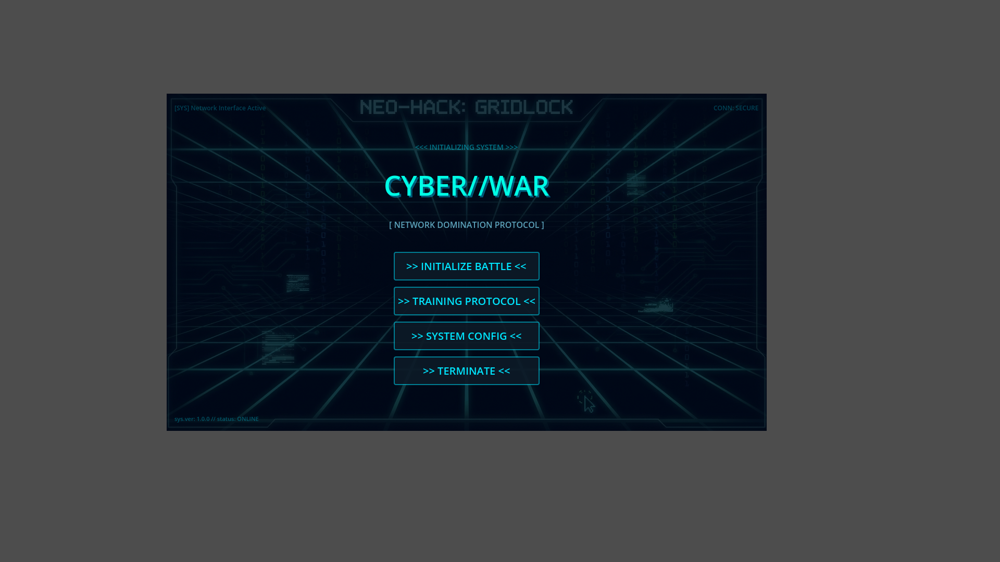
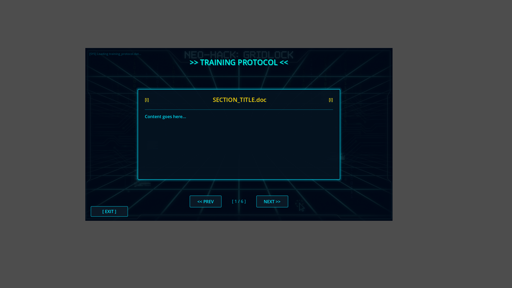
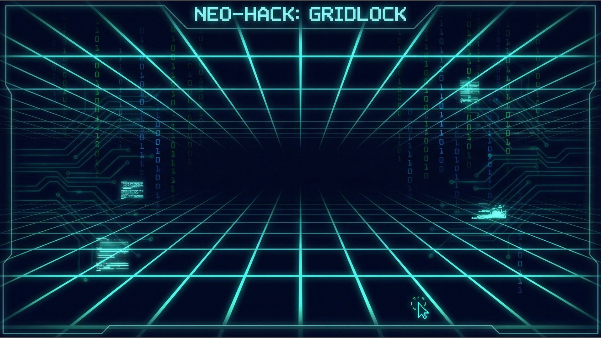

# 🌐 Neo-Hack: Gridlock

[](https://xaviercallens.github.io/webwarcybergame/)

> **Global Cyber Warfare Simulation in full 3D.**

🔥 **[Watch the Global Simulation Trailer](docs/neo_hack_promo_trailer.mp4)** 🔥

<video src="https://github.com/xaviercallens/webwarcybergame/raw/main/docs/neo_hack_promo_trailer.mp4" width="100%" controls autoplay loop muted playsinline></video>

**Neo-Hack: Gridlock** is an immersive, browser-based cyber warfare strategy game played out on a visually stunning 3D globe. Take command of regional nodes, bypass enemy firewalls, and launch coordinated hacking payloads to achieve Total Dominance against rival factions.

## 📸 Core Intel

<div align="center">
  
  
  
</div>

## ✨ Features

- **Interactive 3D Globe**: Built on `Three.js` and `Globe.gl`, interact with a beautiful, fully rotatable, and zoomable globe tracking real-time attack arcs and cyber node rendering.
- **Dynamic Combat System**: Engage in tactical node-based combat. Drain target firewalls using adjacent captured network hubs.
- **Automated Faction AI**: Play against autonomous AI factions competing for global control.
- **Stunning Cyberpunk Aesthetics**: A cohesive hacker-themed UI with CRT scanlines, glitch effects, neon palettes, and atmospheric sound design.
- **Smart Launch System**: A lightning-fast `./launch_local.sh` tool with Vite caching, automated Selenium E2E health checks, and automatic browser deployment.

## 🚀 Quick Start (Local Development)

Getting the global cyber battlefield running locally is designed to be seamless.

### Prerequisites
- Node.js (v20+ recommended)
- Python (3.11+ recommended)

### Installation & Launch

1. Clone the repository.
2. Run the smart launch script:
   ```bash
   chmod +x launch_local.sh
   ./launch_local.sh
   ```

The script features a smart deployment pipeline that will automatically:
- Install frontend dependencies and build the Vite production bundle (caches aggressively to save time).
- Spin up the FastAPI backend on port `8000`.
- Run headless automated Selenium End-to-End tests to verify WebGL stability and dataset integrity.
- Open your default browser to `http://localhost:8000`.

*To force a fresh frontend build without using the cache, run `./launch_local.sh --build`.*

## 🛠️ Technology Stack

- **Frontend Engine**: `Vite`, `Three.js`, `Globe.gl`
- **Backend Architecture**: `FastAPI`, `Uvicorn`, `Python`
- **Testing Integrity**: `Selenium` (End-to-End headless Chrome UI verification)
- **Styling**: Modular CSS design system with CSS Variables

## 🎮 How to Play

1. **Observe**: Your claimed network nodes are designated **GREEN**. Hostile targets are **RED**. Neutral systems are **CYAN**.
2. **Select**: Click your `GREEN` node to access its root terminal.
3. **Attack**: Click an adjacent `RED` or `CYAN` node to launch an encrypted attack payload across the network.
4. **Capture**: Watch the firewall integrity drop. When it reaches 0, the node is successfully routed to your control.
5. **Dominate**: Capture 75% of the globe to achieve Total Dominance!

## 🤝 Contributing
Contributions, tactical suggestions, and feature requests are welcome! Feel free to open an issue or submit a Pull Request.

## 📜 License
This project is distributed under the MIT License.