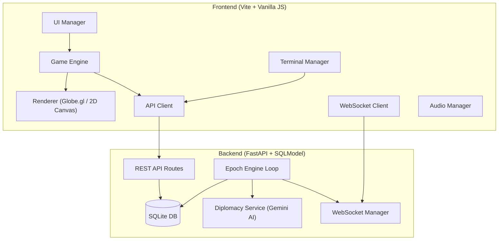
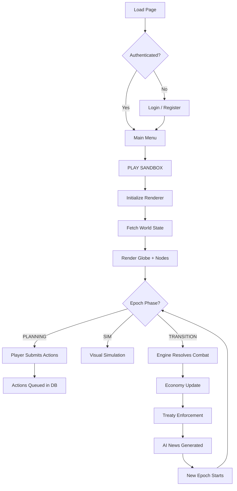

a# Neo-Hack: Gridlock — Functional Specification

> **Version**: 2.0 · **Date**: 2026-03-17 · **Status**: Living Document

---

## 1. Executive Summary

**Neo-Hack: Gridlock** is a real-time, browser-based global cyber warfare strategy game. Players assume the role of a cyber operative for the **Silicon Valley Bloc**, competing against 4 AI-controlled geopolitical factions and 3 non-state actor (CNSA) factions for control of a network of digital nodes scattered across the globe.

The game operates on a **turn-based epoch system** where players submit strategic actions during a PLANNING phase, which are then resolved deterministically during a TRANSITION phase. The core gameplay loop blends territory control, resource management (Compute Units), AI-powered diplomacy, and autonomous agent deployment (Sentinels).

---

## 2. Architecture Overview

| Layer | Technology | Purpose |
|-------|-----------|---------|
| Frontend | Vite, Vanilla JS, Globe.gl, Three.js, Chart.js | Interactive 3D/2D map, HUD, modals |
| Backend | FastAPI, SQLModel, SQLite, Uvicorn | REST API, game engine, WebSockets |
| AI | Google Gemini 2.5 Flash | Faction diplomacy chat, treaty evaluation, epoch news |
| Auth | JWT (HS256) + bcrypt | Stateless player authentication |

---

## 3. Data Model

### 3.1 Factions

| Field | Type | Description |
|-------|------|-------------|
| `id` | int (PK) | Auto-incremented ID |
| `name` | str (unique) | Faction display name |
| `color` | str | Hex color code for UI rendering |
| `compute_reserves` | int | Current Compute Unit (CU) balance |
| `global_influence_pct` | float | Percentage of total nodes owned |

**Playable Factions** (IDs 1–5):

| ID | Name | Color | Base Location | Personality |
|----|------|-------|---------------|-------------|
| 1 | Silicon Valley Bloc | `#00FFDD` | San Francisco | Player-controlled; pragmatic, data-driven |
| 2 | Iron Grid | `#FF4444` | Moscow | Aggressive, transactional, respects power |
| 3 | Silk Road Coalition | `#FFCC00` | Beijing | Opportunistic, trade-focused |
| 4 | Euro Nexus | `#4488FF` | Brussels | Diplomatic, bureaucratic, stability-focused |
| 5 | Pacific Vanguard | `#AA44FF` | Tokyo | Honor-bound, defensive, maritime-focused |

**CNSA Factions** (IDs 6–8) — Non-state actors that provide passive buffs/debuffs through diplomatic accords:

| ID | Name | Color | Special Effect |
|----|------|-------|----------------|
| 6 | Cyber Mercenaries | `#AAAAAA` | **Offense Buff**: +20% attack CU for allies. Charges 100 CU/epoch fee. |
| 7 | Sentinel Vanguard | `#FFFFFF` | **Defense Buff**: +20% base defense for allies. |
| 8 | Shadow Cartels | `#880088` | **Chaos Debuff**: -20% attack CU against allied nodes. |

### 3.2 Nodes

| Field | Type | Description |
|-------|------|-------------|
| `id` | int (PK) | Auto-incremented |
| `name` | str | Generated identifier (e.g., `SIL-N003`) |
| `lat` / `lng` | float | Geographic coordinates |
| `faction_id` | int (FK) | Owning faction |
| `defense_level` | int | Firewall strength (50–1000) |
| `compute_output` | int | CU income per epoch (5–100) |
| `node_class` | enum | `TIER_1`, `TIER_2`, `TIER_3` |

**Node Generation**: Nodes are seeded around each faction's base coordinates with random geographic spread (±10° lat, ±15° lng). Tier distribution: 60% Tier 1, 30% Tier 2, 10% Tier 3.

### 3.3 Players

| Field | Type | Description |
|-------|------|-------------|
| `id` | int (PK) | Auto-incremented |
| `username` | str (unique) | Login identifier |
| `hashed_password` | str | bcrypt hash |
| `xp` | int | Experience points |
| `rank` | str | Current rank title |
| `wins` / `losses` | int | Match statistics |
| `win_streak` / `best_streak` | int | Streak tracking |
| `faction_id` | int (FK) | Assigned faction |

**Rank Progression**:

| XP Threshold | Rank |
|-------------|------|
| 0 | SCRIPT_KIDDIE |
| 500 | PACKET_SNIFFER |
| 1,500 | ROOT_ACCESS |
| 3,500 | ZERO_DAY |
| 7,000 | BLACK_HAT |
| 12,000 | SHADOW_ADMIN |
| 20,000 | GRID_SOVEREIGN |

### 3.4 Epochs

| Field | Type | Description |
|-------|------|-------------|
| `id` | int (PK) | Auto-incremented |
| `number` | int (unique) | Sequential epoch number |
| `phase` | enum | `PLANNING`, `SIM`, `TRANSITION` |
| `started_at` | datetime | UTC timestamp |
| `ended_at` | datetime | Null while active |

### 3.5 Epoch Actions

| Field | Type | Description |
|-------|------|-------------|
| `epoch_id` | int (FK) | Parent epoch |
| `player_id` | int (FK) | Submitting player |
| `action_type` | enum | `SCAN`, `BREACH`, `DEFEND`, `TREATY` |
| `target_node_id` | int (FK) | Target of the action |
| `cu_committed` | int | Compute Units spent |

### 3.6 Accords (Treaties)

| Field | Type | Description |
|-------|------|-------------|
| `faction_a_id` / `faction_b_id` | int (FK) | The two parties |
| `type` | str | `CEASEFIRE`, `ALLIANCE`, `TRADE` |
| `status` | str | `ACTIVE` or `BROKEN` |

### 3.7 Sentinels (Autonomous Agents)

| Field | Type | Description |
|-------|------|-------------|
| `player_id` | int (FK) | Owning player |
| `name` | str | Agent codename |
| `status` | enum | `IDLE` or `DEPLOYED` |

**Sentinel Policies** (4 weight sliders, 0.0–1.0):

| Weight | Effect |
|--------|--------|
| `persistence_weight` | Reserved for future use |
| `stealth_weight` | Higher = targets lowest-defense enemy nodes |
| `efficiency_weight` | Reserved for future use |
| `aggression_weight` | Higher = prefers BREACH over DEFEND |

### 3.8 Other Entities

- **SentinelLog**: Timestamped log of each autonomous action taken by a Sentinel.
- **NewsItem**: AI-generated in-universe news bulletins per epoch.
- **Notification**: Player-specific alerts (COMBAT, DIPLOMACY, EPOCH, SYSTEM).

---

## 4. Epoch Engine (Game Loop)

The epoch engine is the core server-side loop that drives the game forward. It runs as a background `asyncio` task.

### 4.1 Phase Timing

| Phase | Dev Mode | Production |
|-------|----------|------------|
| PLANNING | 0–45s | 0–10 min |
| SIM | 45–55s | 10–14 min |
| TRANSITION | 55–60s | 14–15 min |

The engine polls every **5 seconds** and advances phases based on elapsed time.

### 4.2 PLANNING Phase
- Players may submit actions via the REST API (`POST /api/epoch/action`).
- Actions are queued in the `EpochAction` table.
- Multiple actions to the same node by the same player are **cumulative** (CU is added).

### 4.3 SIM Phase
- Actions are **locked** — no new submissions accepted.
- Frontend displays a visual simulation period.

### 4.4 TRANSITION Phase
The engine resolves all queued actions:

#### Step 1: Inject Sentinel Actions
- All `DEPLOYED` Sentinels auto-generate actions based on their policy weights.
- Each Sentinel spends 50 CU from its faction's reserves.
- High `aggression_weight` → BREACH random enemy node.
- High `stealth_weight` → BREACH lowest-defense enemy node.
- Low aggression → DEFEND random owned node.

#### Step 2: Combat Resolution
For each targeted node:
1. Sum all BREACH CU by faction (applying CNSA buffs/debuffs).
2. Sum all DEFEND CU from the owning faction.
3. Calculate `total_defense = base_defense + defenders`.
4. If `max_attack_cu > total_defense` → **Node is captured** by the strongest attacking faction.
5. On capture: `defense_level` reduced by 10% of attack power (min 50).
6. Notifications sent to affected players via WebSocket.

#### Step 3: Economy Update
- Each faction receives CU income = sum of `compute_output` for all owned nodes.
- `global_influence_pct` recalculated as `owned_nodes / total_nodes × 100`.

#### Step 4: Treaty Enforcement
- For each active Accord, check if either party attacked the other's nodes this epoch.
- If violation detected → Accord status set to `BROKEN`.
- CNSA Mercenary contracts charge 100 CU/epoch; failure to pay breaks the contract.
- TRADE accords pay +50 CU to both parties per epoch.

#### Step 5: AI News Generation
- The Gemini AI generates a dramatic in-universe news bulletin summarizing the epoch's events.

---

## 5. API Reference

### 5.1 Authentication

| Method | Endpoint | Description | Rate Limit |
|--------|----------|-------------|------------|
| `POST` | `/api/auth/register` | Create account, returns JWT | 5/min |
| `POST` | `/api/auth/login` | Authenticate, returns JWT | 5/min |
| `GET` | `/api/players/me` | Get current player profile | — |

### 5.2 World State

| Method | Endpoint | Description |
|--------|----------|-------------|
| `GET` | `/api/world/state` | Returns all nodes |
| `GET` | `/api/epoch/current` | Returns active epoch info |
| `GET` | `/api/faction/{id}` | Returns faction details |
| `GET` | `/api/faction/{id}/economy` | Returns CU balance and income |

### 5.3 Player Actions

| Method | Endpoint | Description |
|--------|----------|-------------|
| `POST` | `/api/epoch/action` | Submit SCAN/BREACH/DEFEND/TREATY |
| `POST` | `/api/players/me/game-over` | Submit match stats for XP |
| `GET` | `/api/leaderboard` | Top players by XP |

### 5.4 Diplomacy

| Method | Endpoint | Description |
|--------|----------|-------------|
| `POST` | `/api/diplomacy/chat` | AI-powered faction chat |
| `POST` | `/api/diplomacy/propose` | Propose CEASEFIRE/ALLIANCE/TRADE |
| `GET` | `/api/diplomacy/accords` | List active treaties |
| `GET` | `/api/news/latest` | AI-generated news feed |

### 5.5 Sentinels

| Method | Endpoint | Description |
|--------|----------|-------------|
| `GET` | `/api/sentinels` | List player's sentinels |
| `POST` | `/api/sentinels/create` | Create a new sentinel |
| `PATCH` | `/api/sentinels/{id}/policy` | Update behavior weights |
| `POST` | `/api/sentinels/{id}/toggle` | Deploy or recall |
| `GET` | `/api/sentinels/{id}/logs` | View action history |

### 5.6 Real-Time

| Protocol | Endpoint | Description |
|----------|----------|-------------|
| WebSocket | `/ws/game?token=...` | Real-time epoch/combat/treaty events |
| `GET` | `/api/notifications` | Player notification history |
| `POST` | `/api/notifications/read` | Mark all as read |

---

## 6. Frontend Architecture

### 6.1 Views and Navigation

| View | Trigger | Components |
|------|---------|------------|
| **Login** | Initial load | Username/password form, Register/Login buttons |
| **Main Menu** | After auth | Play Sandbox, Settings, Leaderboard |
| **Game** | Click Play | Globe/2D canvas, HUD, Info Panel, Terminal, Modals |

### 6.2 Renderer (Globe / 2D Fallback)

**Primary Mode (WebGL):**
- Uses **Globe.gl** with Three.js for a 3D rotating Earth.
- Nodes rendered as colored points at geographic coordinates.
- Connections rendered as animated dashed arcs.
- GeoJSON countries rendered as hex polygons.
- Auto-rotating camera with orbit controls.

**Degraded Mode (2D Canvas Fallback):**
- Activates when WebGL context creation fails (old browsers, no hardware acceleration).
- Draws a 2D Earth circle on a Canvas element.
- Projects lat/lng to X/Y using equirectangular mapping.
- Renders nodes as colored circles (6px for player, 4px for enemies).
- Connections drawn as semi-transparent lines between nodes.
- Click hit-testing with a 15px radius for node selection.
- Statistics displayed in the top-left corner.

### 6.3 HUD (Heads-Up Display)

| Element | Location | Data |
|---------|----------|------|
| Faction Stats | Top-left | Player/Enemy/Ally/Neutral node counts |
| Global Override | Top-left | Player control percentage + progress bar |
| Epoch and Phase | Top-left | Current epoch number, phase, countdown timer |
| Toast Notifications | Top-center | Real-time event alerts (max 4 visible) |
| Node Info Panel | Right side | Selected node name, faction, firewall, compute output |
| Action Panel | Right side | BREACH/SCAN buttons, CU slider, CONTACT AMBASSADOR |
| Hotkeys Panel | Bottom-left | Keyboard shortcut reference |
| Intel Feed | Bottom-right | AI-generated news ticker |

### 6.4 Terminal CLI

Activated with backtick, tilde, or `C` key. Supports the following commands:

| Command | Description |
|---------|-------------|
| `/help` | List all commands |
| `/scan [node_id]` | Show node stats |
| `/breach [node_id]` | Queue BREACH (25 CU) |
| `/defend [node_id]` | Queue DEFEND (25 CU) |
| `/diplomacy` | Open diplomatic channel |
| `/status` | Global faction influence |
| `/epoch` | Current epoch info |
| `/clear` | Clear terminal output |

### 6.5 Diplomacy Modal

- Chat interface with AI faction ambassadors powered by Gemini.
- AI responses include **Emotion Subtitles** (e.g., `[Greedy]`, `[Impatient]`).
- Treaty proposal system with 3 types: `CEASEFIRE`, `ALLIANCE`, `TRADE`.
- AI evaluates proposals based on game state and faction personality.

### 6.6 Sentinel Lab Modal

- Create, configure, deploy, and recall autonomous AI agents.
- **Radar Chart** (Chart.js) visualizes 4 policy weights in real time.
- 4 configurable sliders: Persistence, Stealth, Efficiency, Aggression.
- Operational logs showing per-epoch Sentinel actions.

### 6.7 Keyboard Shortcuts

| Key | Action |
|-----|--------|
| `Space` | Pause / Resume time |
| Hold `A` | Highlight playable nodes |
| Hold `E` | Highlight enemy targets |
| Backtick / `C` | Toggle terminal CLI |

---

## 7. Game Flow

---

## 8. Win Condition and Scoring

### 8.1 Victory Objective
Achieve **75% Global Override** (control 75% of all nodes).

### 8.2 XP Calculation (Post-Match)

| Component | Formula |
|-----------|---------|
| Base XP | 100 (win) / 50 (loss) |
| Capture Bonus | `nodes_captured × 8` |
| Speed Bonus | `max(0, (480 - time_seconds)) / 4` |
| Streak Bonus | `win_streak × 0.1 × base_xp` |

---

## 9. Security and Infrastructure

### 9.1 Authentication
- JWT tokens with HS256 signing, secret from `JWT_SECRET` env var.
- bcrypt password hashing.
- Rate limiting: 5 requests/minute on auth endpoints.

### 9.2 CORS Policy
Allowed origins: production Cloud Run URL, `localhost:5173`, `localhost:8000`.

### 9.3 Static Serving
Backend serves the Vite production build (`dist/`) via FastAPI `StaticFiles` mount at `/`.

### 9.4 Database
SQLite for local development (`cyberwar.db`). Alembic migrations configured.

### 9.5 Deployment
- **Backend**: Google Cloud Run (containerized FastAPI).
- **Frontend**: Bundled into backend container via Vite build.
- Launch script: `launch_local.sh` handles dependency checks, builds, process management, health checks, and Selenium E2E tests.

---

## 10. Audio System

The `AudioManager` provides immersive sound effects via the Web Audio API:

| Sound | Trigger |
|-------|---------|
| `playClick()` | UI button interactions |
| `playAttack()` | Attack submission |
| `playCapture()` | Node captured |
| `playError()` | Error state |
| `playAlarm()` | Treaty broken |
| `playToast()` | Toast notification |

---

## 11. Accessibility Features

| Feature | Implementation |
|---------|---------------|
| Colorblind Mode | `data-colorblind` HTML attribute swaps palette |
| Shape Coding | Nodes use `●` (player), `▲` (enemy), `■` (neutral) |
| Emotion Subtitles | AI diplomacy responses tagged with mood |
| Terminal CLI | Full text-based interface alternative |
| 2D Fallback | Canvas rendering for WebGL-unsupported browsers |

---

## 12. Configurable Node Count

The game supports configurable node counts via the `seed_database(total_nodes)` function. Default: **30 nodes**, evenly distributed across the 5 playable factions (6 per faction). Supports 10–100 nodes in increments of 10.

1. 🛑 The Epoch Engine Loop (Likely backend/engine.py or tasks.py)
I need to check how the async transition phases are handled:

The SIM Phase Paradox: Did they move combat resolution to the start of the SIM phase so the frontend actually has calculated data to animate during the simulation?

Blocking AI Calls: Are the Gemini 2.5 Flash AI news generation calls properly implemented as non-blocking async tasks (e.g., asyncio.create_task())? If they are awaited synchronously, the 3–10 second LLM response time will completely block your strict 5-second server tick rate, causing severe WebSocket desynchronization.

Combat Tie-Breakers: Did they implement deterministic fallback logic for multi-faction attacks that tie in Compute Units (CU)?

2. 🛑 Security & Anti-Cheat (Likely backend/routes/players.py or api.py)
I need to check the FastAPI routing for the severe vulnerabilities we identified:

The Arbitrary XP Exploit: Does POST /api/players/me/game-over still exist in the routers? If a client can send { "xp": 999999 }, they can instantly hit max rank. This logic must have been deleted and moved to the backend engine to evaluate the 75% Global Override win condition securely.

Missing Rate Limits: Are strict rate limiters applied to the /api/diplomacy/chat endpoint to prevent malicious scripts from draining your Google Cloud Gemini API quota?

JWT Token Leakage: Are WebSockets authenticated securely (e.g., via a first-message JSON payload) rather than leaking JWTs in the connection URL query parameters (/ws/game?token=...)?

3. ⚠️ Combat & Economy Math (Likely backend/combat.py or economy.py)
I need to calculate the exact logic for:

Infinite Money Glitch: Did they cap the number of active TRADE accords, or can a player still spam treaties with AI/CNSA factions to generate a risk-free +350 CU/epoch?

Broken Speed Bonus: Did they fix the mathematical impossibility of earning a speed bonus in a 15-minute production match (since the spec hardcoded the par time to 8 minutes)?

Defense Death Spiral: When a node is captured, base defense permanently drops by 10%. Did the developers implement a way to heal base firewall integrity, or does the late-game map inevitably devolve into a chaotic state where every node is permanently stuck at 50 defense?