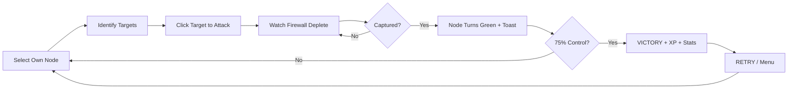

# Neo-Hack: Gridlock — Web Interface Specification

**Version:** 1.0  
**Date:** March 13, 2026  
**Classification:** Game Design Document (GDD) — Web Frontend

---

## 1. Executive Summary

**Neo-Hack: Gridlock** is a real-time cyberpunk strategy game where players hack network nodes to achieve **75% network dominance**. This specification defines a **browser-based web frontend** that replaces the current Godot client, delivering a premium cyberpunk aesthetic with addictive, session-based gameplay loops.

The web client communicates with the existing FastAPI backend (`http://localhost:8000`) and uses **HTML5 Canvas** (via a rendering library) for the interactive network map, with a modern SPA framework for UI chrome.

---

## 2. Design Philosophy

### 2.1 Core Pillars

| Pillar | Description |
|--------|-------------|
| **Visceral Cyberpunk** | Every pixel screams neon-lit, rain-soaked, terminal-hacker fantasy. Dark backgrounds, scan-line overlays, glitch transitions, and monospaced typography. |
| **One More Round** | Sessions are 3–8 minutes. Victory/defeat triggers an instant "RETRY" call-to-action. XP, ranks, and streak bonuses create compulsion loops. |
| **Zero Friction** | Click a node → click its target → attack starts. No menus between intent and action. Touch-friendly for mobile. |
| **Readable at a Glance** | Faction ownership, attack direction, and health status must be understood in <1 second via color, shape, and animation. |

### 2.2 Target Experience

> *"You are a rogue hacker staring at a live network topology. Neon lines pulse with data. You click your node—crosshairs bloom on adjacent enemies. You click. The attack flows visually along the wire. A toast says `[+] NODE CAPTURED`. The progress bar ticks toward 75%. One more node. One more round."*

---

## 3. Visual Design System

### 3.1 Color Palette

```
┌──────────────────────────────────────────────────────┐
│  ROLE          │  DEFAULT          │  COLORBLIND ALT  │
├──────────────────────────────────────────────────────┤
│  Background    │  #0A0E17          │  same            │
│  Panel BG      │  #0D1520 @ 95%    │  same            │
│  Player        │  #00FF88 (green)  │  #3380FF (blue)  │
│  Enemy         │  #FF4444 (red)    │  #FF8000 (orange)│
│  Ally          │  #4488FF (blue)   │  #E6CC33 (yellow)│
│  Neutral       │  #66AAAA (cyan)   │  same            │
│  Accent/CTA    │  #00FFDD (cyan)   │  same            │
│  Warning       │  #FFCC00 (gold)   │  same            │
│  Border/Glow   │  #00CCD6 @ 60%    │  same            │
│  Text Primary  │  #E0F0FF          │  same            │
│  Text Muted    │  #667788          │  same            │
└──────────────────────────────────────────────────────┘
```

### 3.2 Typography

| Usage | Font | Size | Weight |
|-------|------|------|--------|
| Title / Logo | **Orbitron** | 48–64px | 900 |
| Headings | **Rajdhani** | 24–32px | 700 |
| HUD Labels | **Share Tech Mono** | 14–16px | 400 |
| Body Text | **Inter** | 14px | 400 |
| Code/Terminal | **Fira Code** | 13px | 400 |

All text uses `letter-spacing: 0.05em` for that wide cyberpunk terminal feel.

### 3.3 Visual FX Layer

| Effect | Implementation | Trigger |
|--------|---------------|---------|
| **Scan Lines** | CSS `repeating-linear-gradient` overlay, 2px bars at 4px intervals | Always-on, 4% opacity |
| **CRT Vignette** | Radial gradient darkening at edges | Always-on |
| **Glitch Transition** | CSS `clip-path` slicing + `translate` jitter, 300ms | Scene changes, captures |
| **Neon Glow** | `box-shadow` / `text-shadow` with matching hue, multi-layered | Borders, selected text |
| **Screen Flicker** | Brief 50ms luminosity pulse on the viewport | Enemy captures your node |
| **Rain/Particles** | Canvas-based falling particle overlay | Main menu, idle >30s |

### 3.4 Motion Design

- **Easing:** `cubic-bezier(0.25, 0.8, 0.25, 1)` for all UI transitions
- **Duration:** 200ms for micro-interactions, 400ms for panel open/close, 600ms for page transitions
- **Node Pulse:** `scale: 1.0 → 1.06 → 1.0` at 2Hz on hover
- **Attack Flow:** SVG `stroke-dashoffset` animation on connection paths, 120px/s
- **Capture Burst:** Radial particle explosion + ring shockwave, 500ms

---

## 4. Screen Specifications

### 4.1 Main Menu (`/`)

```
┌──────────────────────────────────────────────────────────┐
│                                                          │
│         ╔═══════════════════════════════════════╗         │
│         ║     N E O - H A C K                  ║         │
│         ║     G R I D L O C K                  ║         │
│         ╚═══════════════════════════════════════╝         │
│                                                          │
│                ┌────────────────────┐                     │
│                │   [▶ PLAY]         │                     │
│                │   [◉ RANKED]       │                     │
│                │   [⊡ DEMO MODE]    │                     │
│                │   [⚙ SETTINGS]     │                     │
│                │   [🏆 LEADERBOARD] │                     │
│                └────────────────────┘                     │
│                                                          │
│    [ v1.0 ]                    [ Player: GHOST_4X1 ]     │
│    [ Rank: SCRIPT_KIDDIE ]     [ XP: 245 / 500 ]        │
└──────────────────────────────────────────────────────────┘
```

**Features:**
- Animated background: slow-panning network topology with flowing data packets
- Parallax rain particle overlay
- Title glows with alternating cyan/purple hue shift at 0.5Hz
- Buttons have `border-left: 3px solid var(--accent)` slide-in on hover
- Player card at the bottom shows rank, level, and XP bar (pulled from backend)

### 4.2 Game Screen (`/play`)

```
┌──────────────────────────────────────────────────────────────┐
│ [SYS] Player: 3 | Enemy: 5 | Ally: 1 | Neutral: 10         │
│ // Control: 15% | Target: 75%                                │
│ ████░░░░░░░░░░░░░░░░░░░░░░░░░ 15%    ← Victory Progress Bar │
├──────────────────────────────────────────────────────────────┤
│                                                              │
│                    ● ─── ● ─── ●                             │
│                   / \         / \                             │
│                  ●   ●  ◆  ●   ●    ← Interactive Canvas     │
│                   \ /    |   \ /       (pan, zoom, click)    │
│                    ● ─── ● ─── ●                             │
│                                                              │
├─────────┬──────────────────────────────────┬─────────────────┤
│ MINIMAP │                                  │ SERVER INFO     │
│ ┌─────┐ │  Notification toasts appear      │ ┌─────────────┐│
│ │.·.·.│ │  here (top-center, fading)       │ │ Alpha-0     ││
│ │·.·.·│ │                                  │ │ [CONTROLLED]││
│ │.·.·.│ │                                  │ │ FW: ██████  ││
│ └─────┘ │                                  │ │ PWR: 12.0   ││
│         │                                  │ │ [ATTACK]    ││
│         │                                  │ └─────────────┘│
└─────────┴──────────────────────────────────┴─────────────────┘
```

**Canvas Interactions:**
| Input | Action |
|-------|--------|
| **Left-Click** on own node | Select → show info panel, highlight targets |
| **Left-Click** on highlighted enemy | Launch attack (direct click-to-attack) |
| **Scroll Wheel** | Zoom 0.5×–2.0× toward cursor |
| **Right-Click Drag** | Pan camera |
| **WASD / Arrow Keys** | Pan camera |
| **Escape** | Open pause menu |
| **Spacebar** | Center on selected node |

**HUD Specifications:**
- Top bar: BBCode-style color-coded faction counts (RichText HTML)
- Victory progress bar: amber < 30%, cyan 30–60%, green > 60%
- Notification toasts: top-center, max 4 visible, auto-dismiss 3.5s
- Minimap: bottom-left, 180×180px, clickable for quick-nav
- Server Info: right panel, slides in on selection, shows stats + action buttons
- Alliance Panel: bottom-right, trust bar + alliance request button

### 4.3 Game Over Screen (`/play` overlay)

```
┌──────────────────────────────────┐
│                                  │
│     >> TOTAL DOMINANCE <<        │
│     NETWORK SECURED              │
│                                  │
│     [ MATCH STATISTICS ]         │
│     Time: 04:32                  │
│     Nodes Captured: 14           │
│     Nodes Lost: 2                │
│     Attacks Launched: 16         │
│     Alliances Formed: 1          │
│                                  │
│     ┌─────────┐ ┌─────────────┐  │
│     │  RETRY  │ │  MAIN MENU  │  │
│     └─────────┘ └─────────────┘  │
│                                  │
│     +120 XP EARNED               │
│     STREAK: 3 🔥                  │
│                                  │
└──────────────────────────────────┘
```

**Addictive Features:**
- **XP Reward** displayed with counting animation (0 → 120 over 1.5s)
- **Win Streak** counter with fire emoji, +10% bonus per streak
- **"RETRY" button is pre-focused** (Enter key replays instantly)
- Match stats displayed with staggered fade-in (100ms per line)
- Glitch transition effect on screen appearance

### 4.4 Settings Panel

| Setting | Control | Persists |
|---------|---------|----------|
| Master Volume | Slider 0–100 | ✅ `localStorage` + backend |
| SFX Volume | Slider 0–100 | ✅ |
| Music Volume | Slider 0–100 | ✅ |
| Colorblind Mode | Toggle | ✅ |
| Scan-line Effect | Toggle | ✅ |
| Screen Shake | Toggle | ✅ |
| Map Size | Small / Medium / Large | ✅ |
| Difficulty | Easy / Normal / Hard | ✅ |

### 4.5 Leaderboard (`/leaderboard`)

| Column | Source |
|--------|--------|
| Rank | Computed |
| Username | `GET /api/players/{id}` |
| Wins / Losses | Backend stats |
| Win Rate | Computed |
| Avg. Capture Time | Backend stats |
| Current Streak | Backend stats |

---

## 5. Game Mechanics (Web Translation)

### 5.1 Core Loop



### 5.2 Procedural Map Generation

Each match generates a unique **Jittered Ring Topology**:
- **Center Hub**: 1 neutral high-firewall node
- **Inner Ring**: 5–7 nodes (1 player, 1 enemy, 1 ally, rest neutral), jittered positions
- **Outer Ring**: 11–15 nodes (2 per faction, rest neutral), linked to nearest inner
- **Cross-connections**: 3–6 random links for unpredictability

### 5.3 Combat System

| Parameter | Value |
|-----------|-------|
| Attack Rate | 1 damage / 0.5s |
| Firewall Regen | 2 HP/s when not under attack |
| Max Firewall (default) | 100 HP |
| Hub Max Firewall | 150 HP |
| Processing Power Range | 6–15 (affects attack speed) |

### 5.4 Alliance Mechanics

- Trust range: -100 to +100 (starts at 0)
- Trust builds +5/sec while allied
- Allied nodes auto-attack adjacent enemies
- Breaking alliance costs 50 trust
- Alliance request requires trust ≥ 0

---

## 6. Addictive UX Patterns (Ethical Design)

### 6.1 Engagement Loops

| Loop | Mechanic | Psychological Driver |
|------|----------|---------------------|
| **Session Loop** | 3–8 min matches → instant XP reward → RETRY | Variable ratio reinforcement |
| **Progression Loop** | XP → Level → Rank Title → Cosmetic unlock | Goal gradient effect |
| **Mastery Loop** | Easy → Normal → Hard difficulty → leaderboard climb | Flow state / competence |
| **Social Loop** | Leaderboard rank + win streaks displayed on profile | Social comparison |
| **Collection Loop** | Unlock node skins, attack animations, HUD themes | Completionist drive |

### 6.2 Rank System

| XP Range | Rank Title | Badge |
|----------|------------|-------|
| 0–499 | SCRIPT_KIDDIE | 🔰 |
| 500–1499 | PACKET_SNIFFER | 📡 |
| 1500–3499 | ROOT_ACCESS | 🔓 |
| 3500–6999 | ZERO_DAY | ⚡ |
| 7000–11999 | BLACK_HAT | 🎩 |
| 12000–19999 | SHADOW_ADMIN | 👁️ |
| 20000+ | GRID_SOVEREIGN | 👑 |

### 6.3 XP Formula

```
base_xp = 50  (loss) | 100 (win)
capture_bonus = nodes_captured × 8
speed_bonus = max(0, (480 - time_seconds)) / 4    # Faster = more XP
streak_bonus = win_streak × 0.1 × base_xp         # +10% per streak
total_xp = base_xp + capture_bonus + speed_bonus + streak_bonus
```

### 6.4 Session Retention Triggers

| Moment | Trigger |
|--------|---------|
| After victory | "You're 80 XP from PACKET_SNIFFER!" |
| After defeat | "You were SO close — 68% control. Try again?" |
| On streak end | "Your best streak was 5. Can you beat it?" |
| On revisit | "Welcome back, GHOST_4X1. Ready for round 7?" |

---

## 7. Technical Architecture

### 7.1 Stack

| Layer | Technology | Rationale |
|-------|-----------|-----------|
| **Rendering** | [Pixi.js](https://pixijs.com/) v8 | WebGL2 canvas, 60fps node rendering, particle effects |
| **UI Framework** | Vanilla JS + Web Components | No framework overhead, maximum control |
| **Styling** | CSS Custom Properties + `@layer` | Design token system, no build step needed |
| **Audio** | [Howler.js](https://howlerjs.com/) | Cross-browser procedural audio |
| **State** | Single Zustand-like store (vanilla) | Predictable state, easy debug |
| **Networking** | `fetch` + `EventSource` (SSE) | REST for actions, SSE for live state |
| **Build** | Vite | Fast HMR, ES modules, tiny bundle |
| **Deploy** | FastAPI static serve (`/build/web/`) | Single binary deployment |

### 7.2 Frontend ↔ Backend Communication

```
Browser (SPA)                      FastAPI Backend
─────────────                      ──────────────
                                   
POST /api/auth/login ──────────►   JWT token returned
                                   
GET /api/games/{id} ───────────►   Full game state JSON
                                   
POST /api/games/{id}/moves ────►   { action: "attack",
                                     from: "node-3",
                                     to: "node-7" }
                                   
GET /api/games/{id}/stream ────►   SSE: real-time state
  (EventSource)                    updates every 500ms
                                   
GET /api/leaderboard ──────────►   Ranked player list
```

### 7.3 File Structure

```
build/web/
├── index.html              # SPA entry, meta tags, fonts
├── assets/
│   ├── fonts/              # Orbitron, Share Tech Mono, Inter
│   ├── audio/              # Procedural FX (generated at build)
│   └── textures/           # Node sprites, backgrounds
├── styles/
│   ├── tokens.css          # CSS custom properties (design tokens)
│   ├── base.css            # Reset, typography, scan-lines
│   ├── components.css      # Buttons, panels, bars, toasts
│   └── screens.css         # Layout per screen
├── scripts/
│   ├── main.js             # App bootstrap + router
│   ├── renderer.js         # Pixi.js canvas + node rendering
│   ├── game-engine.js      # Combat, AI, procedural gen
│   ├── ui-manager.js       # HUD, panels, notifications
│   ├── audio-manager.js    # Howler.js procedural audio
│   ├── api-client.js       # fetch wrappers for backend
│   ├── state-store.js      # Centralized reactive state
│   └── utils/
│       ├── colors.js       # Palette logic + colorblind
│       ├── math.js         # Vector2, ring positions
│       └── animations.js   # Tweening, easing curves
└── sw.js                   # Service worker for offline play
```

### 7.4 Performance Targets

| Metric | Target |
|--------|--------|
| First Contentful Paint | < 1.2s |
| Time to Interactive | < 2.0s |
| Canvas FPS (25 nodes) | ≥ 60fps |
| Canvas FPS (50 nodes) | ≥ 45fps |
| Total JS bundle | < 150KB gzipped |
| Total CSS | < 25KB |
| Lighthouse Score | ≥ 90 |

---

## 8. API Contract (Frontend Expectations)

The backend already has these endpoints prepared. The web client expects:

### 8.1 Authentication

```http
POST /api/auth/register
Content-Type: application/json
{ "username": "GHOST_4X1", "password": "..." }
→ 201 { "token": "jwt...", "player": { "id": 1, "rank": "SCRIPT_KIDDIE" } }

POST /api/auth/login
→ 200 { "token": "jwt...", "player": { ... } }
```

### 8.2 Game Session

```http
POST /api/games
Authorization: Bearer <jwt>
{ "difficulty": "normal", "map_size": "medium" }
→ 201 { "game_id": "abc-123", "state": { nodes: [...], connections: [...] } }

POST /api/games/{id}/moves
{ "action": "attack", "from_node": 3, "to_node": 7 }
→ 200 { "state": { ... }, "events": ["node_captured", ...] }

GET /api/games/{id}/stream
→ SSE stream: data: { "tick": 42, "state": { ... } }
```

### 8.3 Leaderboard & Profile

```http
GET /api/leaderboard?limit=50
→ 200 { "rankings": [{ "rank": 1, "username": "...", "xp": 21450, "wins": 87 }] }

GET /api/players/me
Authorization: Bearer <jwt>
→ 200 { "username": "...", "xp": 245, "rank": "SCRIPT_KIDDIE", "stats": { ... } }
```

---

## 9. Accessibility

| Feature | Implementation |
|---------|---------------|
| Colorblind Mode | Toggle in settings, swaps red/green for orange/blue palette globally |
| Keyboard Navigation | Full keyboard support: Tab for UI, WASD for camera, Enter for confirm |
| Screen Reader | `aria-live` regions for toast notifications and game events |
| Reduced Motion | `prefers-reduced-motion` media query disables particles and glitch FX |
| High Contrast | Optional HC mode with thicker borders and larger text |
| Touch Support | All interactions work via touch (tap = click, pinch = zoom, drag = pan) |

---

## 10. Offline & Progressive Web App

| Feature | Implementation |
|---------|---------------|
| Offline Play | Service worker caches all static assets; single-player mode works offline |
| Installable | `manifest.json` with app icon, splash screen, standalone display |
| Push Notifications | "Your streak is at risk!" reminder after 24h inactivity (opt-in) |
| Background Sync | Queued moves sync when back online |

---

## 11. Verification Plan

### 11.1 Automated

- Lighthouse CI audit (score ≥ 90 across all categories)
- Canvas rendering benchmark (60fps with 25 nodes)
- Bundle size check (< 150KB gzipped)
- E2E tests via Playwright: login → play → capture → win → retry flow

### 11.2 Manual

1. Open `/` — animated main menu loads, rain particles visible
2. Click PLAY — procedural map generates, HUD renders with correct counts
3. Click own node — info panel appears, enemy targets glow red
4. Click enemy target — attack animation flows along connection line
5. Win the game — stats screen with XP tally animates, RETRY is focused
6. Toggle Colorblind Mode — all colors swap to blue/orange/yellow
7. Zoom/pan via scroll + drag — canvas transforms smoothly
8. Test on mobile viewport (375px) — layout responsive, touch works

---

## 12. Implementation Phases

| Phase | Scope | Effort |
|-------|-------|--------|
| **Phase 1** | Static SPA shell: main menu + settings + routing | 3 days |
| **Phase 2** | Pixi.js canvas: nodes, connections, pan/zoom | 4 days |
| **Phase 3** | Game engine: combat, AI, procedural gen (port from GDScript) | 5 days |
| **Phase 4** | HUD, notifications, minimap, info panel | 3 days |
| **Phase 5** | Backend integration: auth, game sessions, leaderboard | 4 days |
| **Phase 6** | Polish: audio, particles, glitch FX, PWA | 3 days |
| **Phase 7** | XP/rank system, win streaks, retention triggers | 2 days |
| **Total** | | **~24 days** |

---

*Specification authored for the Neo-Hack: Gridlock development team.*  
*Target: Modern browsers (Chrome 120+, Firefox 120+, Safari 17+, Edge 120+).*
